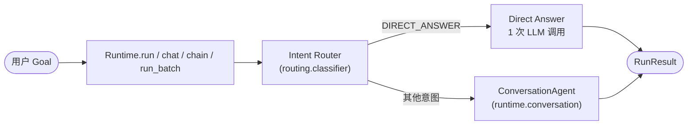
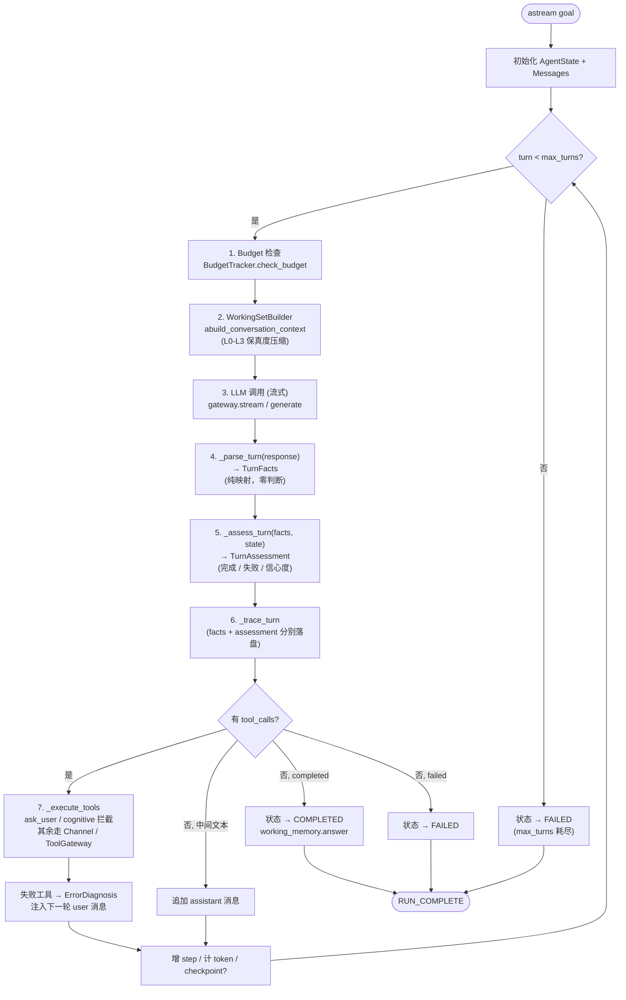

# Arcana 系统架构文档

> 本文档对应当前默认实现：**V2 引擎 `ConversationAgent`**。
> V1 (`Agent` + `AdaptivePolicy` + `Reducer`) 已降级为兼容路径，详见末节"遗留兼容"。

---

## 1. 项目简介

**Arcana 是 LLM Agent 的操作系统 (OS)，不是流水线 (Pipeline)。**

> A pipeline dictates: do step 1, then step 2, then step 3.
> An operating system provides: here are your capabilities, here are your boundaries, go solve the problem.
> — *CONSTITUTION.md, Chapter I*

Arcana 是一个 **Contracts-First** 的 Agent 平台：所有数据流都先在 `contracts/` 里以 Pydantic Schema 定义，实现层永远不发明 ad-hoc dict。这使得未来向 Go/Rust 迁移可以保持上层逻辑不变。

**核心设计原则**（与 `CONSTITUTION.md` 九条 Principles 对齐）：

- **Default to Direct, Escalate to Agent** — 简单请求走单次 LLM 调用，复杂请求才进入 Agent 循环
- **Context as Working Set, Not Archive** — 上下文是当前推理步骤的工作集，不是仓库
- **Tools as Capabilities, Not Interfaces** — 工具不是 API 包装，而是 LLM 可推理的能力
- **Allow Strategy Leaps** — LLM 不欠我们逐步思考过程，可以一步跳到答案
- **Structured, Actionable Feedback** — 错误反馈必须可推理，不是裸异常字符串
- **Runtime as OS, Not Form Engine** — Runtime 提供服务，不规定流程
- **Judge by Outcomes, Not by Process** — 衡量 Agent 看是否达成目标，不是是否走完模板
- **Agent Autonomy in Collaboration** — 多 Agent 协作时框架只提供通信基建，不强加层级
- **Cognitive Primitives as Services** — Runtime 也为 LLM 自身的推理状态提供服务（recall / pin / unpin），但绝不代为调用

**四条禁令** (`CONSTITUTION.md` Chapter II)：
- No Premature Structuring · No Controllability Theater · No Context Hoarding · No Mechanical Retry

---

## 2. 模块进度概览

| 模块 | 状态 | 说明 |
|------|------|------|
| **Contracts** | 完成 | Pydantic 数据契约：`turn` / `routing` / `context` / `diagnosis` / `llm` / `tool` / `state` / `streaming` / `cognitive` 等 |
| **Trace** | 完成 | JSONL 审计日志：Writer / Reader / Replay；每次 LLM 调用自动落盘 |
| **Gateway** | 完成 | `ModelGatewayRegistry` + `OpenAICompatibleProvider`，多 provider fallback、prompt caching、`batch_generate` |
| **Runtime** | 完成 | **`ConversationAgent` (V2，默认引擎)**：LLM Turn → TurnFacts → TurnAssessment → State；并行工具、思考信号、ask_user 拦截、checkpoint |
| **Routing** | 完成 | `IntentClassifier` 规则 + LLM 双层分流；`DIRECT_ANSWER` 走单次调用，其余进入 ConversationAgent |
| **Context** | 完成 | `WorkingSetBuilder` 工作集装配 + 4 级保真度压缩 (L0-L3) + LLM 摘要兜底 |
| **ToolGateway** | 完成 | 鉴权 / 校验 / 幂等 / 重试 / 审计；`call_many` 按 side-effect 分派：read 并发、write 顺序 |
| **Cognitive Primitives** | 部分 | 已实现：`recall` / `pin` / `unpin`（拦截式工具，不走 ToolGateway）；`branch` / `anchor` / `hint` 仍在 roadmap |
| **Diagnosis** | 完成 | `ErrorDiagnosis` 结构化错误简报，工具失败转为下一轮 user 消息注入给 LLM |
| **Multi-Agent** | 完成 | `AgentPool` + `Channel` + `SharedContext`；用户控制编排，框架只提供通信基建 |
| **Streaming** | 完成 | `StreamEvent` / `StreamEventType`；`astream()` / `chat.stream()` |
| **Memory / RAG** | 部分 | Runtime 级 `RunMemoryStore`；长期记忆 / RAG 检索仍在演进 |
| **Storage** | 待实现 | 持久化后端（LevelDB / Redis / Postgres）|

---

## 3. 默认执行路径



入口是 `Runtime`，它持有长寿命资源（providers、tools、budget、trace、memory）。每次 `run()` 内部：

1. **意图分类**（可选）：`IntentClassifier` 用规则 + LLM fallback 决定是否走快路径
2. **快路径** (`DIRECT_ANSWER`)：调用 `DirectExecutor.direct_answer`，单次 LLM 调用直接返回
3. **Agent 路径**：交给 `ConversationAgent.astream()` 跑 turn 循环

> **No Premature Structuring**：Arcana 不在 Agent 进入循环前规划步骤；规划是 LLM 自己的事。

---

## 4. Turn Loop（V2 核心）

`ConversationAgent` 以一条很薄的抽象取代了 V1 的 `Policy → StepExecutor → Reducer` 链：

> **`LLMResponse` → `TurnFacts` → `TurnAssessment` → `State`**



### 4.1 `TurnFacts` vs `TurnAssessment` —— 必须可见地分离

`contracts/turn.py` 强制此分离：

| | 由谁产出 | 内容 |
|---|---|---|
| `TurnFacts` | LLM (provider response) | `assistant_text` · `tool_calls` · `usage` · `finish_reason` · `thinking` |
| `TurnAssessment` | Runtime | `completed` · `failed` · `answer` · `completion_reason` · `confidence` |

> *The LLM does not judge its own output; the runtime does not generate content.*

`_parse_turn()` 只做 provider → framework 的纯映射，**禁止**填写任何 `completed / failed`。`_assess_turn()` 才做解读：

- 有 `tool_calls` → 未完成（LLM 还想做事）
- 既无文本也无工具 → `failed = empty_response`
- `finish_reason == "stop"` 且有文本 → `completed`，置信度 0.85
- 若 thinking 含"need to verify / 需要验证"等 → `completed = False`（**Thinking as Signal**）
- 若 thinking 含"not sure / 不确定" → `confidence *= 0.6`

> **关键约束**：Runtime 听 thinking 信号是为了改善自身判断，**不是**反过来约束 LLM 的策略。"听" ≠ "强迫思考"。

---

## 5. Runtime Services

> **Runtime as OS** —— Runtime 提供服务，不规定流程。每个服务都是 LLM 可调用的能力，而不是它必须经过的步骤。

### 5.1 Budget Enforcement
`gateway.budget.BudgetTracker` 管 `max_cost_usd` / `max_tokens` / `max_iterations` / `max_time_ms`。每个 turn 开头 `check_budget()` 一次，每次 LLM 用量 `add_usage()`。超额抛 `BudgetExceededError`。

### 5.2 Trace
`TraceWriter` 写 JSONL：`TURN`（含 facts + assessment）、`CONTEXT_DECISION`、`TOOL_CALL`、`COGNITIVE_PRIMITIVE`、可选 `PROMPT_SNAPSHOT`。所有摘要走 `utils/hashing.py` 的 SHA-256 截断 16 字符。

### 5.3 Tool Dispatch
工具调用走 `ExecutionChannel`（默认 `LocalChannel` 包装 `ToolGateway`），便于未来切到子进程 / 容器 / 远程后端。

**派发模型**（按宪章 Principle 3 + side-effect 区分）：

- **Read 工具**：`asyncio.gather` 并发执行
- **Write 工具**：顺序执行，避免冲突
- 由 `ToolGateway.call_many()` 根据 `ToolSpec.side_effect` 自动分流

`ask_user` 与认知原语（`recall` / `pin` / `unpin`）**不走** ToolGateway —— `ConversationAgent._execute_tools` 直接拦截分发。

### 5.4 Context — Working Set + Fidelity Compression
`context.builder.WorkingSetBuilder.abuild_conversation_context()` 每个 turn 重建一次工作集，按 token budget 在 4 级保真度间裁剪：

| 级别 | 处理 |
|------|------|
| **L0** | 原文保留 |
| **L1** | 截断到约 300 字符 |
| **L2** | 单行摘要 |
| **L3** | 仅保留角色标签；继续超额时整条丢弃 |

低相关度消息先被降级；预算仍紧张时回退到 LLM 摘要 → 直接丢弃。pinned 内容（来自 `pin` 原语）以 `pinned=True` 的 `ContextBlock` 注入 Working 层，**不可压缩**。

### 5.5 Diagnostics
`runtime.diagnosis.diagnoser.diagnose_tool_error` 把 `ToolError` 转成 `ErrorDiagnosis`：包含失败类别、可能原因、可执行的下一步建议。结果作为 user 消息追加到对话，让 LLM 自己决定恢复策略 —— 这是宪章 Principle 5 (**Structured, Actionable Feedback**) + 第 4 禁令 (**No Mechanical Retry**) 的实现。

### 5.6 ask_user — 能力，不是流程
`runtime.ask_user.ASK_USER_SPEC` 注册为内置工具，schema 出现在工具列表里。当 LLM 调用 `ask_user` 时：

1. 在 `_execute_tools` 里被拦截，**不进** ToolGateway
2. 通过 `AskUserHandler` 调用用户提供的 `input_handler`
3. **若没有 input_handler**：LLM 收到 fallback 消息，继续按自身判断推进

> **Inviolable Rule**：用户从不被强制中途交互。`ask_user` 是 LLM 可开的门，不是它必须走的走廊。LLM 也**绝不阻塞等待**用户回答 —— 没回应就当作信号，自己想办法。

### 5.7 Cognitive Primitives — 仅 `recall` / `pin` / `unpin`
v0.7.0 引入，由 `RuntimeConfig.cognitive_primitives` 显式启用（默认空，零行为变化）。以拦截式工具（与 `ask_user` 同机制）暴露给 LLM：

- **`recall(turn, include?)`** — 取出某历史 turn 的原始内容，绕开 working-set 压缩
- **`pin(content, label?, until_turn?)`** — 把关键内容钉住，未来 working-set 不压缩；幂等（同内容返回同 `pin_id`）；超出 `pin_budget_fraction * total_window` 即拒绝
- **`unpin(pin_id)`** — 释放 pin

> Roadmap（**当前未实现**，宪章 Principle 9 中已提及但 `runtime/cognitive.py` 尚未实现）：
> - `branch` — 沙箱化推理分支，可提交或丢弃
> - `anchor` — 标记暂定假设，未来可被信号化失效
> - `hint` — 提示下一次 working-set 构建偏好
>
> 这三个是**未来工作**；引用它们不应假设当前可调用。

> **Inviolable Rule**：框架绝不代 LLM 调用认知原语，绝不在 prompt 里暗示使用，绝不评估 LLM 是否"用得对"。提供服务 ≠ 规定使用。

---

## 6. 公开 API

入口都在 `arcana.Runtime` 上：

| 方法 | 用途 |
|------|------|
| `runtime.run(goal, ...)` | 单次任务：路由 → ConversationAgent / Direct → `RunResult` |
| `runtime.stream(goal)` | 流式版本，逐事件吐 `StreamEvent` |
| `runtime.chat()` | 多轮会话；返回 `ChatSession`，`send` / `stream` 内部委托给 `ConversationAgent`，因此自动获得 ask_user / 懒加载工具 / 保真度压缩 / 思考评估 |
| `runtime.chain(steps, input?)` | 顺序流水线，`ChainStep` 组成；嵌套 `list[ChainStep]` 表示并行分支；上一步输出自动作为下一步 `<context>` |
| `runtime.run_batch(tasks, concurrency=5)` | 并发跑多个独立任务，`asyncio.Semaphore` 控量；返回 `BatchResult`（含每条 `RunResult`） |
| `runtime.collaborate(...)` | 多 Agent 协作池；返回 `AgentPool`（async context manager） |
| `runtime.session()` | 手动控制底层 `Session`（高级用法） |
| `runtime.budget_scope(...)` | 局部 budget 子作用域 |
| `runtime.on / off` | Runtime 事件钩子（pub/sub） |

`run()` 关键参数：`engine`（默认 `"conversation"`）、`provider` / `model`、`tools`、`response_format`（Pydantic 类，结构化输出）、`images`（多模态）、`input_handler`、`system`、`context`、`on_parse_error`、`budget`。

> `runtime.team(...)` 已 deprecated（保留向后兼容），新代码应使用 `runtime.collaborate(...)`。

---

## 7. Contracts 层 —— 数据法

所有跨模块数据都先在 `src/arcana/contracts/` 定义为 Pydantic 模型。这是 Arcana 的"数据法"：实现可以替换，契约不能脱钩。

| 文件 | 关键模型 |
|------|---------|
| `turn.py` | `TurnFacts` · `TurnAssessment` · `TurnOutcome` |
| `routing.py` | `RoutingDecision` · `IntentCategory` · `IntentType` |
| `context.py` | `ContextBlock` · `ContextLayer` · `TokenBudget` · `ContextDecision` · `MessageDecision` · `ContextReport` · `ContextStrategy` · `WorkingSet` · `StepContext` |
| `diagnosis.py` | `ErrorDiagnosis` · `ErrorCategory` |
| `llm.py` | `LLMRequest` · `LLMResponse` · `ModelConfig` · `Message` · `ContentBlock` · `ToolCallRequest` · `TokenUsage` |
| `tool.py` | `ToolSpec` · `ToolCall` · `ToolResult` · `ToolError` · `SideEffect` · `ASK_USER_TOOL_NAME` |
| `cognitive.py` | `RecallRequest/Result` · `PinRequest/Result/State/Entry` · `UnpinRequest/Result` |
| `state.py` | `AgentState` · `ExecutionStatus` |
| `runtime.py` | `RuntimeConfig` 等运行期配置 |
| `streaming.py` | `StreamEvent` · `StreamEventType` |
| `channel.py` | `ExecutionChannel` 协议（Brain / Hands 通信分离） |

**Canonical Hashing**：`utils/hashing.py.canonical_hash(obj)` 对排序后的 JSON 算 SHA-256，截 16 字符，用于 trace 摘要和幂等键。

**Trace = Audit Log**：每次 LLM 调用、工具调用、context 决策、cognitive 调用都被记录。可用 `TraceReader` 离线回放（`replay_prompt`）—— 当 `RuntimeConfig.trace_include_prompt_snapshots=True` 或 `dev_mode=True` 时，会额外落盘 `PROMPT_SNAPSHOT`。

---

## 8. Provider 抽象

`gateway/registry.py.ModelGatewayRegistry` 是单一接入点：

- **`OpenAICompatibleProvider`** —— 通用适配器，把 OpenAI 格式 API 复用给 DeepSeek / Kimi / GLM / MiniMax / Ollama 等，只需改 `base_url`
- **原生适配器** —— Anthropic、Gemini 各自原生 SDK，把响应规整到统一的 `LLMResponse`（带 `anthropic` / `gemini` 子字段保留 provider 特性）
- **Fallback Chain** —— 多 provider 注册时按 dict 插入顺序自动建链；首选失败且 `error.retryable=True` 时自动切到下一个
- **Prompt Caching**（透明优化）：
  - Anthropic：自动给 system prompt + tool schemas 打 `cache_control` 标签
  - OpenAI：自动追踪 `cached_tokens`
  - 应用层零感知，零改动
- **`batch_generate(requests, concurrency=...)`** —— 单 provider 与 Registry 都暴露；用 `asyncio.Semaphore` 限流

`ProviderProfile` 描述 provider 的能力（是否支持 tools、json_schema、思考、流式等），不支持的请求会自动降级（例如 MiniMax 收到 tools 请求会降级为文本提示）。

---

## 9. 多 Agent 协作

`runtime.collaborate(...)` 返回 `AgentPool`（`multi_agent/agent_pool.py`）：

- **共享通信基建**：`Channel`（消息总线）+ `SharedContext`（共享存储）+ 共享 `BudgetTracker`
- **每个 Agent 是独立 `ChatSession`**：自己的 system prompt、provider/model 选择、可选独立 cognitive_primitives 配置
- **用户控制编排**：何时谁说话、读谁的消息、何时结束 —— 全部由用户代码决定

> **Principle 8 (Agent Autonomy)**：框架绝不强加 planner/executor 之类的层级。如果出现这种模式，那是因为 Agent 的 prompt 自己定义了角色，而不是框架强迫的拓扑。

详见 `docs/guide/multi-agent.md`（如有）以及 `examples/` 中的协作样例。

---

## 10. 遗留兼容（V1）

V1 的执行模型 —— `Agent` + `AdaptivePolicy` (含 ReAct / Plan-Execute 历史变体) + `Reducer` —— 仍保留在 `runtime/agent.py`，可通过 `engine="adaptive"` 选择：

```python
result = await arcana.run("...", engine="adaptive")
```

**这不是推荐路径**。V1 的多策略 Policy / StepExecutor / Reducer 链与宪章第 1 禁令（**No Premature Structuring**）和第 4、6 条 Principles 存在张力，仅为了向后兼容而保留，不再接受新功能：

- 新增功能（多模态、并行工具、保真度压缩、cognitive 原语、collaborate）只在 V2 路径上实现
- V1 旧学习文档已归档至 `docs/legacy/`
- 长期路线图：当 V1 用户全部迁移到 V2 后移除（移除策略见 `CONSTITUTION.md` Amendment 2 / removals policy）

---

## 11. 关键路径速查

| 概念 | 路径 |
|------|------|
| V2 Agent 引擎 | `src/arcana/runtime/conversation.py` |
| Runtime + Session + Chat + Chain + Batch | `src/arcana/runtime_core.py` |
| Turn 契约 | `src/arcana/contracts/turn.py` |
| Intent 路由 | `src/arcana/routing/classifier.py` · `routing/executor.py` |
| Working Set + 保真度压缩 | `src/arcana/context/builder.py` |
| Tool 执行 | `src/arcana/tool_gateway/gateway.py` · `tool_gateway/local_channel.py` |
| ask_user | `src/arcana/runtime/ask_user.py` |
| 认知原语 (recall/pin/unpin) | `src/arcana/runtime/cognitive.py` · `contracts/cognitive.py` |
| 错误诊断 | `src/arcana/runtime/diagnosis/diagnoser.py` |
| Provider Gateway | `src/arcana/gateway/registry.py` · `gateway/openai_compat.py` |
| Trace | `src/arcana/trace/writer.py` · `trace/reader.py` |
| 多 Agent | `src/arcana/multi_agent/agent_pool.py` · `multi_agent/channel.py` |
| V1 (legacy) | `src/arcana/runtime/agent.py` · `runtime/policies/` |

---

## 12. 扩展阅读

- [`constitution.md`](./constitution.md) — 九条 Principles + 四条禁令 + 责任划分（这是法律，不是建议）
- [`guide/quickstart.md`](./guide/quickstart.md) · [`guide/api.md`](./guide/api.md) — 快速开始、配置、Provider、API 参考
- [`specs/`](./specs/) — 各模块设计 spec（含 V2 conversation-loop 详设、cognitive primitives amendment 等）
- [`legacy/`](./legacy/) — V1 学习材料（仅供历史参考）
- 仓库根 `CLAUDE.md` — 开发者速查（不在 mkdocs 渲染范围内）

---

**文档版本**：3.0（V2 重写）
**对应代码**：`runtime/conversation.py` · `runtime_core.py`
**最近大幅变动**：v0.7.0 引入认知原语 (recall/pin/unpin)；v0.8.x 加固 Channel / MessageBus 边界；`team()` deprecated → `collaborate()`
