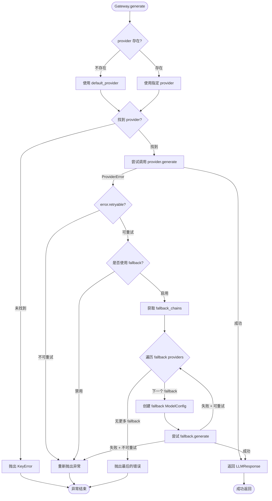
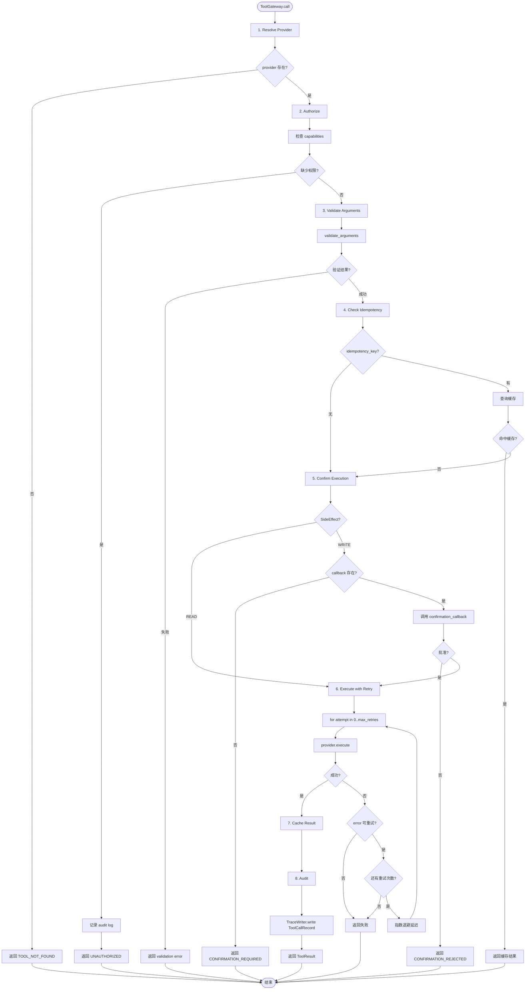
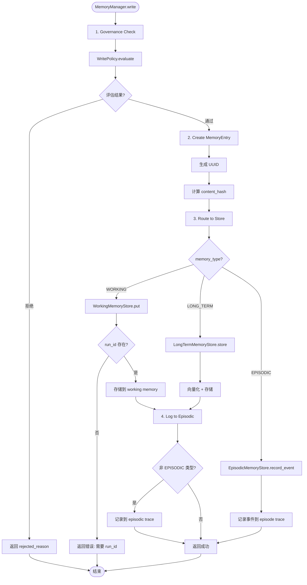

# Arcana 系统架构文档

## 1. 项目简介

Arcana 是一个基于 Contracts-First 设计的 Agent 平台，通过 Pydantic 定义所有数据契约，支持未来向 Go/Rust 迁移而不改变上层逻辑。

**核心特性**：
- 🔐 **Contract-Driven Design**: 所有接口先定义数据契约
- 📝 **JSONL Audit Trail**: 完整的 trace 日志记录
- 🔄 **Multi-Policy Support**: 支持 ReAct、Plan-Execute 等策略
- 🛠️ **Tool Gateway**: 工具鉴权、幂等性、重试机制
- 🧠 **Memory System**: Working/Long-term/Episodic 三层记忆
- 👥 **Multi-Agent Orchestration**: 任务调度与团队协作

---

## 2. 模块进度概览

| 模块 | 状态 | 说明 |
|------|------|------|
| **Contracts** | ✅ 完成 | 数据契约层：Trace/Tool/State/LLM/Memory/Plan/Multi-Agent |
| **Trace** | ✅ 完成 | JSONL 审计日志：Writer/Reader/查询/分析 |
| **Gateway** | ✅ 完成 | 模型网关：Registry/BudgetTracker/OpenAI兼容 |
| **Runtime** | ✅ 完成 | 执行引擎：Agent/StepExecutor/Policy/Reducer |
| **ToolGateway** | ✅ 完成 | 工具执行：鉴权/验证/幂等性/重试/审计 |
| **Memory** | ✅ 完成 | 记忆系统：Working/LongTerm/Episodic/Governance |
| **Multi-Agent** | ✅ 完成 | 多智能体：Team/MessageBus/Orchestrator |
| **Orchestrator** | ✅ 完成 | 任务调度：DAG调度/并发执行/重试策略 |
| **Storage** | ⏳ 待实现 | 存储后端：LevelDB/Redis/Postgres |
| **RAG** | ⏳ 待实现 | 检索增强：Indexing/Retrieval/Citations |

---

## 3. 用户消息完整流转流程图

```mermaid
flowchart TD
    Start([用户输入 Goal]) --> Init[Agent.run 初始化]
    Init --> CreateState[创建 AgentState]
    CreateState --> SetRunning[状态转换 → RUNNING]
    SetRunning --> HookStart[调用 on_run_start Hooks]
    HookStart --> MainLoop{主循环}

    MainLoop --> CheckStop[检查停止条件]
    CheckStop -->|达到 max_steps| StopMaxSteps[停止: MAX_STEPS]
    CheckStop -->|无进展次数过多| StopNoProgress[停止: NO_PROGRESS]
    CheckStop -->|预算耗尽| StopBudget[停止: MAX_TOKENS/COST/TIME]
    CheckStop -->|连续错误过多| StopError[停止: ERROR]
    CheckStop -->|无停止条件| ExecuteStep[执行单步]

    ExecuteStep --> PolicyDecide[Policy.decide]
    PolicyDecide --> ReActCheck{Policy 类型?}

    ReActCheck -->|ReAct| ReActDecision[ReAct Policy<br/>构建 history + memory<br/>返回 llm_call]
    ReActCheck -->|PlanExecute| PlanCheck{Plan 状态?}

    PlanCheck -->|无 Plan| PlanPhase[Plan 阶段<br/>返回 llm_call]
    PlanCheck -->|Plan 失败| FailDecision[返回 fail]
    PlanCheck -->|Plan 未完成| ExecutePhase[Execute 阶段<br/>执行下一步<br/>返回 llm_call]
    PlanCheck -->|Plan 完成| VerifyPhase[Verify 阶段<br/>返回 verify]

    ReActDecision --> StepExecute[StepExecutor.execute]
    PlanPhase --> StepExecute
    ExecutePhase --> StepExecute
    VerifyPhase --> StepExecute
    FailDecision --> StepExecute

    StepExecute --> ActionType{decision.action_type?}

    ActionType -->|llm_call| LLMCall[执行 LLM 调用]
    ActionType -->|tool_call| ToolCall[执行工具调用]
    ActionType -->|complete| CompleteAction[返回 goal_reached=True]
    ActionType -->|verify| VerifyAction[执行验证]
    ActionType -->|fail| FailAction[返回失败结果]

    LLMCall --> BuildRequest[构建 LLMRequest]
    BuildRequest --> CheckBudget[BudgetTracker.check_budget]
    CheckBudget -->|预算不足| BudgetError[抛出 BudgetExceeded]
    CheckBudget -->|预算充足| GatewayGenerate[Gateway.generate]

    GatewayGenerate --> GetProvider[Registry.get provider]
    GetProvider --> ProviderCall[Provider.generate]
    ProviderCall --> UpdateBudget[更新 BudgetTracker]
    UpdateBudget --> Validate{是否需要验证?}

    Validate -->|有 schema| ValidateJSON[OutputValidator.validate_json]
    Validate -->|需要结构化| ValidateStructured[validate_structured_format]
    Validate -->|无需验证| ParseResponse[解析 Thought/Action]

    ValidateJSON -->|验证失败| RetryCheck{重试次数?}
    ValidateStructured -->|验证失败| RetryCheck
    RetryCheck -->|< max_retries| RetryPrompt[添加错误反馈<br/>重试 LLM 调用]
    RetryCheck -->|= max_retries| ValidationError[返回验证失败 StepResult]

    ValidateJSON -->|验证成功| ParseResponse
    ValidateStructured -->|验证成功| ParseResponse
    ParseResponse --> CheckFinish{Action == FINISH?}
    CheckFinish -->|是| StepFinish[StepResult: goal_reached=True]
    CheckFinish -->|否| StepThink[StepResult: THINK]

    ToolCall --> CheckGateway{ToolGateway?}
    CheckGateway -->|未配置| ToolError[返回错误]
    CheckGateway -->|已配置| CallMany[ToolGateway.call_many]

    CallMany --> SeparateCalls[区分 Read/Write 调用]
    SeparateCalls --> ReadParallel[Read 工具并发执行]
    SeparateCalls --> WriteSerial[Write 工具顺序执行]
    ReadParallel --> SingleCall[ToolGateway.call 单个工具]
    WriteSerial --> SingleCall

    SingleCall --> ResolveProvider[Registry.get provider]
    ResolveProvider -->|未找到| NotFoundError[返回 TOOL_NOT_FOUND]
    ResolveProvider -->|找到| CheckCapabilities[检查 capabilities]

    CheckCapabilities -->|缺少权限| AuthError[返回 UNAUTHORIZED]
    CheckCapabilities -->|有权限| ValidateArgs[validate_arguments]

    ValidateArgs -->|参数错误| ArgError[返回 NON_RETRYABLE]
    ValidateArgs -->|参数正确| CheckIdempotency[检查幂等性缓存]

    CheckIdempotency -->|命中缓存| CachedResult[返回缓存结果]
    CheckIdempotency -->|无缓存| ConfirmCheck{需要确认?}

    ConfirmCheck -->|Write 工具| ConfirmCallback[调用 confirmation_callback]
    ConfirmCheck -->|Read 工具| ExecuteWithRetry[执行带重试]

    ConfirmCallback -->|拒绝| ConfirmReject[返回 CONFIRMATION_REJECTED]
    ConfirmCallback -->|批准| ExecuteWithRetry

    ExecuteWithRetry --> ProviderExecute[Provider.execute]
    ProviderExecute -->|成功| CacheAndAudit[缓存结果 + 审计日志]
    ProviderExecute -->|失败 + 可重试| RetryBackoff{重试次数?}
    ProviderExecute -->|失败 + 不可重试| ReturnFailure[返回失败结果]

    RetryBackoff -->|< max_retries| ExponentialBackoff[指数退避延迟]
    RetryBackoff -->|= max_retries| ReturnFailure
    ExponentialBackoff --> ProviderExecute

    CacheAndAudit --> TraceLog[TraceWriter.write<br/>ToolCallRecord]
    TraceLog --> ToolResultDone[返回 ToolResult]

    ToolResultDone --> AggregateResults[聚合所有工具结果]
    AggregateResults --> StepAct[StepResult: ACT]

    CompleteAction --> StepComplete[StepResult: VERIFY]
    VerifyAction --> StepVerify[StepResult: VERIFY]
    FailAction --> StepFail[StepResult: 失败]

    StepFinish --> ReducerReduce[Reducer.reduce]
    StepThink --> ReducerReduce
    StepAct --> ReducerReduce
    StepComplete --> ReducerReduce
    StepVerify --> ReducerReduce
    StepFail --> ReducerReduce

    ReducerReduce --> UpdateState[更新 AgentState]
    UpdateState --> ProgressDetect[ProgressDetector.record_step]
    ProgressDetect --> CheckProgress{是否有进展?}

    CheckProgress -->|无进展| IncrementNoProgress[consecutive_no_progress++]
    CheckProgress -->|有进展| ResetNoProgress[consecutive_no_progress=0]

    IncrementNoProgress --> CheckGoalReached{goal_reached?}
    ResetNoProgress --> CheckGoalReached

    CheckGoalReached -->|是| HandleStop[处理停止: GOAL_REACHED]
    CheckGoalReached -->|否| CheckCheckpoint{是否需要 Checkpoint?}

    CheckCheckpoint -->|需要| CreateCheckpoint[StateManager.checkpoint<br/>保存 StateSnapshot]
    CheckCheckpoint -->|不需要| HookStepComplete[调用 on_step_complete Hooks]

    CreateCheckpoint --> HookStepComplete
    HookStepComplete --> MainLoop

    StopMaxSteps --> HandleStop
    StopNoProgress --> HandleStop
    StopBudget --> HandleStop
    StopError --> HandleStop
    BudgetError --> HandleError[处理异常]

    HandleStop --> TransitionState{停止原因?}
    TransitionState -->|GOAL_REACHED| SetCompleted[状态 → COMPLETED]
    TransitionState -->|其他| SetFailed[状态 → FAILED]

    SetCompleted --> LogStopEvent[TraceWriter.write<br/>STATE_CHANGE]
    SetFailed --> LogStopEvent

    HandleError --> IncrementErrors[consecutive_errors++]
    IncrementErrors --> SetFailedError[状态 → FAILED]
    SetFailedError --> LogErrorEvent[TraceWriter.write<br/>ERROR]

    LogStopEvent --> HookRunEnd[调用 on_run_end Hooks]
    LogErrorEvent --> HookRunEnd
    HookRunEnd --> End([返回最终 AgentState])
```



---

## 4. Gateway 子流程



---

## 5. ToolGateway 子流程



---

## 6. Memory 子流程



---

## 7. Multi-Agent Team 协作流程

```mermaid
flowchart TD
    Start([TeamOrchestrator.run]) --> InitSession[创建 CollaborationSession]
    InitSession --> RoundLoop{for round in 1..max_rounds}

    RoundLoop --> BudgetGuard[检查全局预算]
    BudgetGuard --> BudgetOK{预算充足?}
    BudgetOK -->|否| BudgetExhausted[返回 budget_exhausted]
    BudgetOK -->|是| BuildPlannerGoal[构建 Planner Goal]

    BuildPlannerGoal --> HasFeedback{有反馈?}
    HasFeedback -->|是| AddFeedback[添加上轮反馈]
    HasFeedback -->|否| PlainGoal[使用原始 goal]

    AddFeedback --> RunPlanner[1. 运行 Planner]
    PlainGoal --> RunPlanner

    RunPlanner --> CreatePlannerAgent[创建 Planner Agent]
    CreatePlannerAgent --> PlannerRun[Planner.run]
    PlannerRun --> PlannerError{异常?}

    PlannerError -->|是| HandleError[处理角色错误]
    PlannerError -->|否| ExtractPlan[从 working_memory 提取 plan]

    ExtractPlan --> PublishPlan[MessageBus.publish PLAN message]
    PublishPlan --> RunExecutor[2. 运行 Executor]

    RunExecutor --> CreateExecutorAgent[创建 Executor Agent]
    CreateExecutorAgent --> ExecutorRun[Executor.run]
    ExecutorRun --> ExecutorError{异常?}

    ExecutorError -->|是| HandleError
    ExecutorError -->|否| ExtractResult[从 working_memory 提取 result]

    ExtractResult --> PublishResult[MessageBus.publish RESULT message]
    PublishResult --> RunCritic[3. 运行 Critic]

    RunCritic --> CreateCriticAgent[创建 Critic Agent]
    CreateCriticAgent --> CriticRun[Critic.run]
    CriticRun --> CriticError{异常?}

    CriticError -->|是| HandleError
    CriticError -->|否| ExtractVerdict[从 working_memory 提取 verdict]

    ExtractVerdict --> CheckVerdict{verdict in APPROVED?}

    CheckVerdict -->|是| Approved[记录 TASK_COMPLETE]
    Approved --> ReturnCompleted[返回 status=completed]

    CheckVerdict -->|否| Rejected[记录 TASK_FAIL]
    Rejected --> ExtractFeedback[提取 feedback]
    ExtractFeedback --> PublishFeedback[MessageBus.publish FEEDBACK message]
    PublishFeedback --> NextRound{round < max_rounds?}

    NextRound -->|是| RoundLoop
    NextRound -->|否| Escalate[发布 ESCALATE message]

    Escalate --> ReturnEscalated[返回 status=escalated]

    HandleError --> LogError[记录错误 trace]
    LogError --> ReturnError[返回 status=error]

    BudgetExhausted --> End([返回 HandoffResult])
    ReturnCompleted --> End
    ReturnEscalated --> End
    ReturnError --> End
```



---

## 8. 核心数据流

### 8.1 执行流程

```
用户 Goal
  ↓
Agent.run() 初始化
  ↓
while 未达停止条件:
  ├─ Policy.decide() → PolicyDecision
  ├─ StepExecutor.execute(decision)
  │   ├─ llm_call → Gateway.generate() → LLMResponse
  │   └─ tool_call → ToolGateway.call() → ToolResult
  ├─ Reducer.reduce(state, step_result) → new_state
  ├─ ProgressDetector.record_step()
  └─ StateManager.checkpoint() (if needed)
  ↓
返回最终 AgentState
```

### 8.2 Checkpoint 触发条件

- **interval**: 每 N 步 (默认 5)
- **error**: 步骤执行失败
- **plan_step**: Plan-Execute 策略完成一个步骤
- **verification**: 执行验证步骤后
- **budget**: 预算达到阈值 (50%, 75%, 90%)

### 8.3 停止条件

- **GOAL_REACHED**: `goal_reached=True` (状态 → COMPLETED)
- **MAX_STEPS**: 达到 `max_steps` (状态 → FAILED)
- **NO_PROGRESS**: 连续 N 轮无进展 (状态 → FAILED)
- **MAX_TOKENS/COST/TIME**: 预算耗尽 (状态 → FAILED)
- **ERROR**: 连续错误次数过多 (状态 → FAILED)

---

## 9. 技术要点

### 9.1 Canonical Hashing
所有摘要使用 SHA-256 对排序后的 JSON 计算，截断至 16 字符：
```python
from arcana.utils.hashing import canonical_hash
digest = canonical_hash({"key": "value"})  # "a1b2c3d4e5f6g7h8"
```

### 9.2 TraceEvent 审计
每个重要操作自动写入 JSONL 日志：
```json
{
  "run_id": "uuid",
  "step_id": "uuid",
  "event_type": "LLM_CALL",
  "request_digest": "hash",
  "response_digest": "hash",
  "timestamp": "ISO8601"
}
```

### 9.3 BudgetTracker
实时跟踪资源消耗：
```python
tracker = BudgetTracker(max_tokens=10000, max_cost_usd=1.0)
tracker.check_budget()  # 抛出 BudgetExceededError
```

### 9.4 Tool Authorization
基于 capabilities 的权限控制：
```python
gateway = ToolGateway(
    registry=registry,
    granted_capabilities={"file.read", "web.search"}
)
# 调用 file.write 会返回 UNAUTHORIZED
```

### 9.5 Memory Governance
WritePolicy 控制写入规则：
```python
policy = WritePolicy(
    min_confidence=0.7,
    max_write_rate=100  # per minute
)
result = policy.evaluate(write_request)
```

---

## 10. 关键文件路径

| 组件 | 路径 |
|------|------|
| Agent 主循环 | `src/arcana/runtime/agent.py` |
| Step 执行器 | `src/arcana/runtime/step.py` |
| ReAct Policy | `src/arcana/runtime/policies/react.py` |
| Plan-Execute Policy | `src/arcana/runtime/policies/plan_execute.py` |
| Model Gateway | `src/arcana/gateway/registry.py` |
| Tool Gateway | `src/arcana/tool_gateway/gateway.py` |
| Memory Manager | `src/arcana/memory/manager.py` |
| Team Orchestrator | `src/arcana/multi_agent/team.py` |
| Task Orchestrator | `src/arcana/orchestrator/orchestrator.py` |
| State Contracts | `src/arcana/contracts/state.py` |
| Runtime Contracts | `src/arcana/contracts/runtime.py` |

---

## 11. 扩展阅读

- [specs/](./specs/) - 功能规格文档 (RAG, State, Tool, Trace)
- [legacy/KNOWLEDGE.md](./legacy/KNOWLEDGE.md) - 核心概念深度解析 (v1)
- [legacy/RUNTIME_KNOWLEDGE.md](./legacy/RUNTIME_KNOWLEDGE.md) - Runtime 模块详解 (v1)
- [../CLAUDE.md](../CLAUDE.md) - 开发者指南

---

**文档版本**: 2.0
**更新日期**: 2026-03-18
**作者**: doc-writer (arcana-report team)
